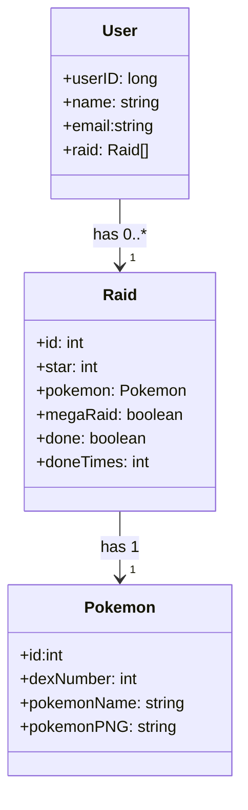

# API REST FULL JAVA
## Controlador de Raids.

A Raid Organizer API é uma ferramenta projetada para aprimorar a experiência de jogadores do Pokémon GO, permitindo um controle eficaz das Raids já realizadas. Este sistema foi desenvolvido para solucionar um problema comum entre os jogadores, fornecendo um mecanismo para rastrear as incursões executadas e otimizar a utilização dos passes disponíveis.

## Objetivo
O objetivo central desta API é fornecer aos jogadores de Pokémon GO uma maneira confiável de gerenciar suas Raids passadas. O jogo apresenta uma conquista que requer a participação em um determinado número de raids diferentes para ser alcançada, no entanto, não oferece uma ferramenta nativa para o acompanhamento de quais delas já foram realizadas. A Raid Organizer API resolve esse problema, permitindo que os jogadores registrem suas Raids concluídas em suas contas pessoais.



## Endpoints

Para cadastrar um usuário novo deve ser informado o seu nome e email.
```
{
  "name": "Kleiton",
  "email": "Kleiton@gmail.com"
}
```

Para adicionar uma Raid realizada, informa o email e em seguida as informações da raid.
```
{
  "star": 5,
  "pokemon": {
    "dexNumber": 144,
    "pokemonName": "Articuno",
    "pokemonPNG": "https://assets.pokemon.com/assets/cms2/img/pokedex/full/144.png"
  },
  "megaRaid": false,
  "done": true,
  "doneTimes": 1
}
```

## Acesse a documentação Swagger pelo link 

[RaidOrganizer](https://raidorganizer.up.railway.app/swagger-ui/index.html#/user-controller/addRaidByEmail)
 